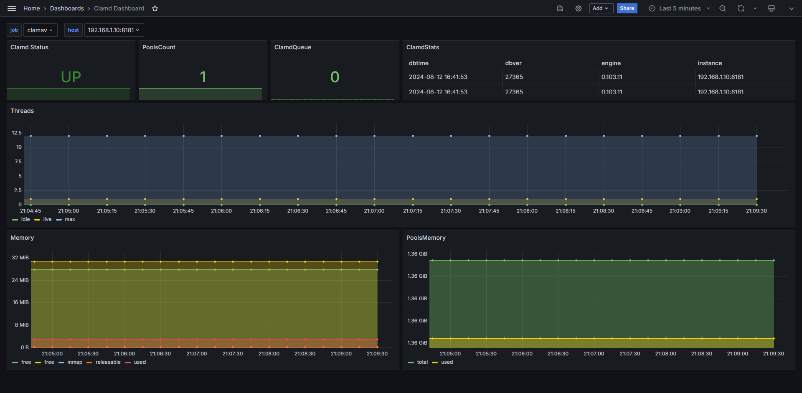

# clamd_exporter

[](https://pkg.go.dev/github.com/hq0101/clamd_exporter)

从clamd服务导出指标以供Prometheus使用


# 概述

clamd_exporter是一个轻量级的监控工具，它能够收集ClamAV的clamd服务运行状态和性能指标，并将这些指标以Prometheus兼容的格式暴露出来。这使得在复杂的系统监控环境中，能够轻松地对ClamAV的防病毒服务进行监控和警报设置。


# 使用

## 安装

由于clamd_exporter是一个Go编写的应用程序，因此你需要从源代码编译或使用预编译的二进制文件。可以从GitHub仓库的[Releases](https://github.com/hq0101/clamd_exporter/releases)页面下载最新版本的二进制文件。

## 运行

默认情况下，clamd_exporter在/metrics的端口0.0.0.0:8080上提供服务。你可以通过命令行参数来自定义这些设置：

参数：
- --listen: 设置监听地址和端口（默认0.0.0.0:8080）
- --address：ClamAV服务器的地址，可以是UNIX套接字路径（如/var/run/clamav/clamd.ctl）或TCP地址（如127.0.0.1:3310）
- --nettype: 指定连接类型，tcp或unix

例如，要监听在本地端口的8181上，并从默认TCP地址127.0.0.1:3310获取ClamAV指标，可以运行：
```shell
./clamd_exporter-v0.1.0.linux-amd64 --listen :8181 --address 127.0.0.1:3310 --nettype tcp
or
./clamd_exporter-v0.1.0.linux-amd64 --listen :8181 --address /var/run/clamav/clamd.ctl --nettype tcp
```

# Prometheus配置

在Prometheus的配置文件中，添加一个新的抓取任务来收集clamd_exporter暴露的指标：

```yaml
scrape_configs:
  - job_name: "clamd_exporter"
    static_configs:
      - targets: ["192.168.1.10:8181"]
```

# Grafana Dashboard



为了可视化监控数据，可以使用Grafana并导入我们提供的[Dashboard模板](https://github.com/hq0101/clamd_exporter/blob/main/assets/ClamdDashboard.json)。这将帮助你快速创建包含关键性能指标和警报的仪表板。


